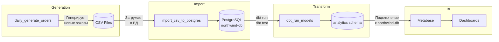
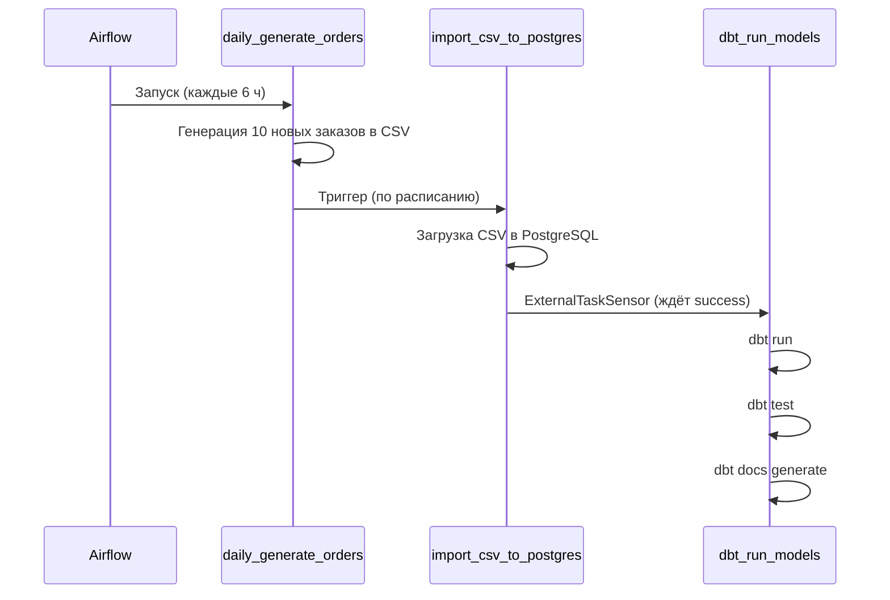
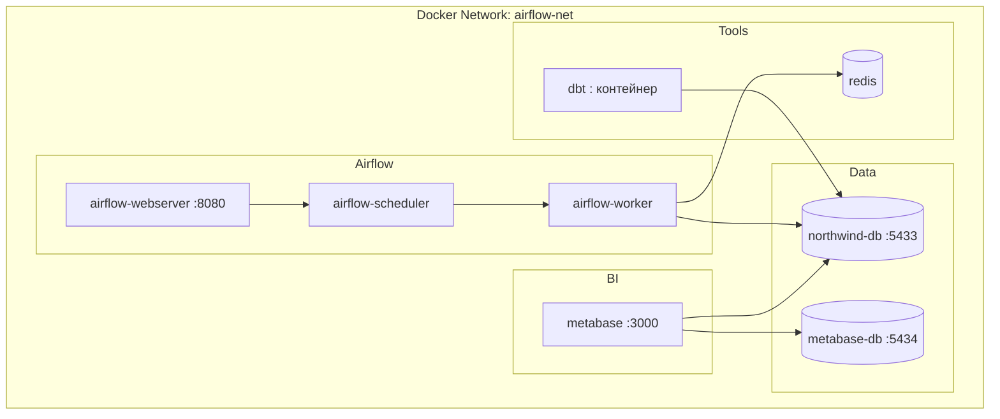
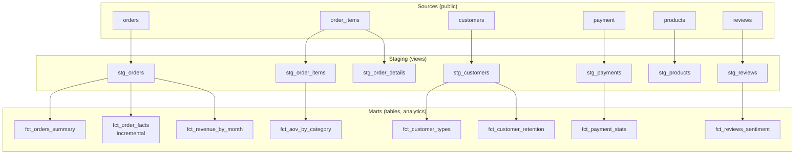

# Архитектура проекта Online Shop

## Обзор

Проект реализует ETL/ELT-пайплайн для аналитики данных интернет-магазина:

```
CSV (plugins/) → PostgreSQL → DBT (analytics) → Metabase
       ↑              ↑              ↑
   Airflow DAG    Airflow DAG    Airflow DAG
```

## Диаграмма потоков данных



## Последовательность DAG-ов



## Инфраструктура (Docker)



## Схема данных

### Сырые таблицы (public)

| Таблица | Описание |
|---------|----------|
| orders | Заказы (order_id, order_date, customer_id, total_price) |
| order_items | Позиции заказов (order_item_id, order_id, product_id, quantity, price_at_purchase) |
| customers | Клиенты |
| products | Товары (product_id, product_name, category, price) |
| payment | Платежи (order_id, payment_method, amount, transaction_status) |
| shipments | Отгрузки |
| reviews | Отзывы (product_id, customer_id, rating, review_text, review_date) |
| suppliers | Поставщики |

### DBT: Sources → Staging → Marts



## Incremental-модель

`fct_order_facts` — единственная incremental-модель:

- **Стратегия:** merge по `order_id`
- **Фильтр:** при инкрементальном запуске обрабатываются только заказы с `order_date >= max(order_date)` в целевой таблице
- **Использование:** ускорение загрузки при росте объёма данных

## Связи сервисов

| Откуда | Куда | Протокол/Порт |
|--------|------|---------------|
| Airflow | northwind-db | PostgreSQL 5432 |
| Airflow | redis | Redis 6379 |
| dbt | northwind-db | PostgreSQL 5432 |
| Metabase | northwind-db | PostgreSQL 5432 |
| Metabase | metabase-db | PostgreSQL 5432 |
| Пользователь | Airflow | HTTP 8080 |
| Пользователь | Metabase | HTTP 3000 |

## Рекомендации по масштабированию

- **Рост данных:** увеличить число incremental-моделей, партиционирование по дате
- **Частота запуска:** изменить `schedule_interval` в DAG
- **Мониторинг:** логи Airflow, алерты при падении DAG
- **CI/CD:** GitHub Actions для `dbt test`, `dbt build` при push
