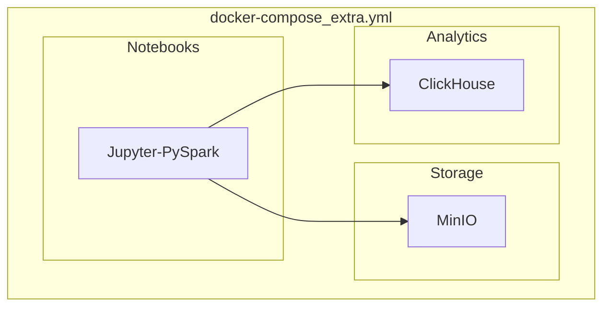

# Архитектура проекта Online Shop

## Обзор

Проект реализует ETL/ELT-пайплайн для аналитики данных интернет-магазина:

```
CSV (plugins/) → PostgreSQL → DBT (analytics) → Metabase
       ↑              ↑              ↑
   Airflow DAG    Airflow DAG    Airflow DAG
```

## Диаграмма потоков данных


## Последовательность DAG-ов


## Инфраструктура (Docker)

### Основной стек (docker-compose.yml)


### Дополнительный стек (docker-compose_extra.yml)

Файл `docker-compose_extra.yml` добавляет опциональные сервисы для расширения стенда:

| Сервис | Назначение | Порты |
|--------|------------|-------|
| **ClickHouse** | Аналитический движок (OLAP), колоночное хранение | HTTP, Native |
| **MinIO** | Локальное S3-совместимое хранилище | S3 API, Web-консоль |
| **Jupyter-PySpark** | Интерактивная аналитика, Spark | Jupyter Lab |



**Запуск с дополнительным стеком:**
```bash
docker compose -f docker-compose.yml -f docker-compose_extra.yml up -d
```

**Требования:** переменные в `.env` для ClickHouse, MinIO, Jupyter (см. примеры в docker-compose_extra.yml).

## Схема данных

### Сырые таблицы (public)

| Таблица | Описание |
|---------|----------|
| orders | Заказы (order_id, order_date, customer_id, total_price) |
| order_items | Позиции заказов (order_item_id, order_id, product_id, quantity, price_at_purchase) |
| customers | Клиенты |
| products | Товары (product_id, product_name, category, price) |
| payment | Платежи (order_id, payment_method, amount, transaction_status) |
| shipments | Отгрузки |
| reviews | Отзывы (product_id, customer_id, rating, review_text, review_date) |
| suppliers | Поставщики |

### DBT: Sources → Staging → Marts


## Файлы конфигурации Docker

| Файл | Назначение |
|------|------------|
| `docker-compose.yml` | Основной стек: Airflow, PostgreSQL, Redis, DBT, Metabase |
| `docker-compose_extra.yml` | Дополнительно: ClickHouse, MinIO, Jupyter-PySpark |

## Incremental-модель

`fct_order_facts` — единственная incremental-модель:

- **Стратегия:** merge по `order_id`
- **Фильтр:** при инкрементальном запуске обрабатываются только заказы с `order_date >= max(order_date)` в целевой таблице
- **Использование:** ускорение загрузки при росте объёма данных

## Семантический слой (metrics.yml)

Файл `dbt/models/marts/metrics.yml` определяет семантические модели и метрики для:
- **fct_order_facts:** order_count, total_revenue, total_items, avg_order_value
- **fct_orders_summary:** orders_count, total_sales, customer_count

Описания соответствуют SQL-запросам и CTE в моделях. Поддержка dbt Semantic Layer / MetricFlow.

## Связи сервисов

| Откуда | Куда | Протокол/Порт |
|--------|------|---------------|
| Airflow | northwind-db | PostgreSQL 5432 |
| Airflow | redis | Redis 6379 |
| dbt | northwind-db | PostgreSQL 5432 |
| Metabase | northwind-db | PostgreSQL 5432 |
| Metabase | metabase-db | PostgreSQL 5432 |
| Пользователь | Airflow | HTTP 8080 |
| Пользователь | Metabase | HTTP 3000 |

## Рекомендации по масштабированию

### Базовые задачи

| Задача | Описание |
|--------|----------|
| **Рост данных** | Увеличить число incremental-моделей, партиционирование по дате |
| **Частота запуска** | Изменить `schedule_interval` в DAG |
| **Мониторинг** | Логи Airflow, алерты при падении DAG |
| **CI/CD** | GitHub Actions для `dbt test`, `dbt build` при push |

### Дополнительные задачи масштабирования

| # | Задача | Описание |
|---|--------|----------|
| 1 | **Масштабирование Airflow** | Увеличить `AIRFLOW__CELERY__WORKER_CONCURRENCY`, добавить worker'ов при росте DAG |
| 2 | **Партиционирование PostgreSQL** | Партиционировать большие таблицы (orders, order_items) по order_date |
| 3 | **Миграция в ClickHouse** | Выгружать аналитические витрины в ClickHouse для OLAP-запросов (через Airflow DAG) |
| 4 | **S3/MinIO для сырых данных** | Хранить CSV/архивы в MinIO, загружать в БД по расписанию |
| 5 | **Read replicas** | Настроить read replica PostgreSQL для Metabase при высокой нагрузке |
| 6 | **Кэширование Metabase** | Включить кэш вопросов, увеличить TTL для тяжёлых дашбордов |
| 7 | **dbt Semantic Layer** | Использовать metrics.yml для единых метрик в BI (MetricFlow) |
| 8 | **Горизонтальное масштабирование** | Добавить Celery worker'ы, Redis Cluster при необходимости |
